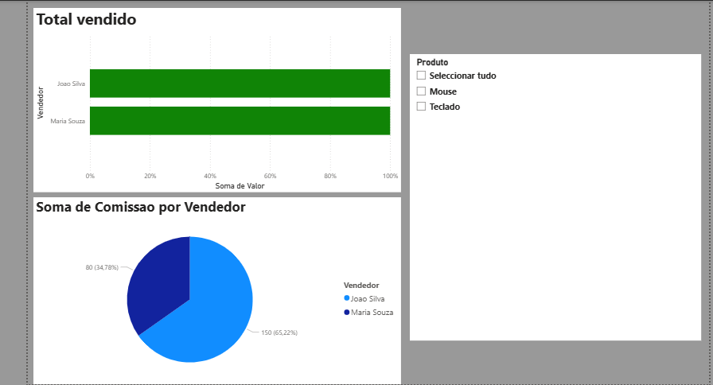

# Pipeline de ETL: Vendas e Cotação de Moedas 

Este projeto demonstra um pipeline de dados completo, desde a extração de dados brutos até a visualização em um Dashboard interativo.

## Tecnologias Utilizadas
* **Python 3.12+**: Processamento e limpeza de dados.
* **Pandas**: Biblioteca principal para manipulação de DataFrames.
* **Requests**: Consumo de API de câmbio em tempo real.
* **Power BI**: Visualização de dados e criação de KPIs.

## O que o projeto faz?
1. **Extração:** Coleta dados de vendas locais (CSV) e cotação do dólar (API externa).
2. **Transformação:** Limpa nomes de vendedores, trata tipos de dados (String para Float) e calcula comissões.
3. **Carga:** Gera arquivos otimizados que alimentam um Dashboard automático no Power BI.

## Como executar
1. Execute `pipeline_csv.py` para processar as vendas.
2. Execute `pipeline_cambio.py` para atualizar o câmbio.
3. Abra os arquivos `PWBI_projectETL_example1.pbix e PWBI_projectETL_example2Cambio.pbix` no Power BI e clique em 'Atualizar'.
4. 
